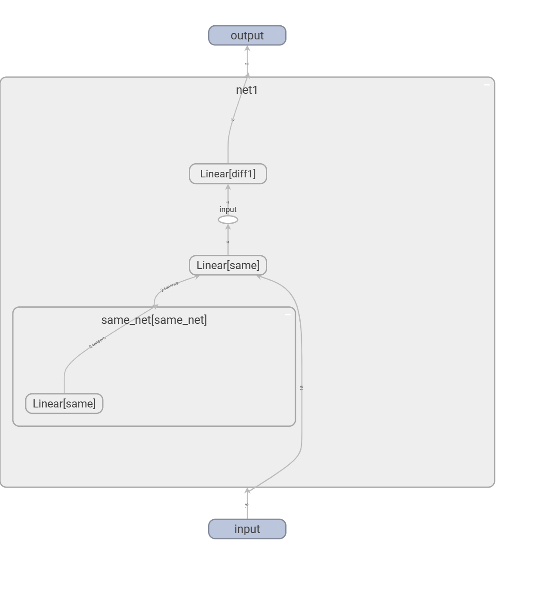

# 记录在感知组学习强化的过程
@wily
## 第一周
```text
1. 学习了eplison-greedy, UCB，汤普孙策略  
前面二者相对简单，UCB需要知道霍夫丁不等式
汤普孙策略需要知道数据分布的共轭分布族
```
## 第二周
```text
1. 学习了MP,MRP,MDP
2. 手撕贝尔曼方程 
```

## 开学第一周
```text
1. test中证明了可以写一个类来更新其中的参数
即实现了actor 和 critic 在cnn层的参数共享
```
